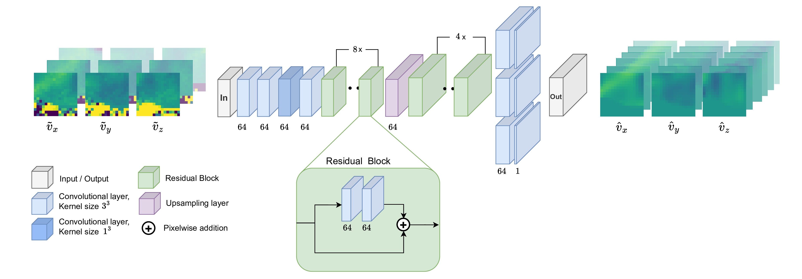
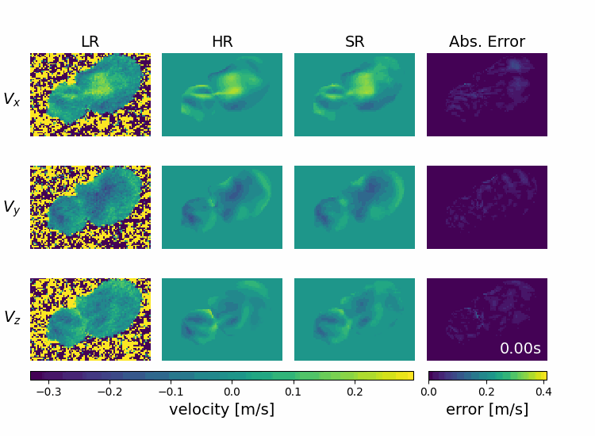

# Temporal4DFlowNet
### Deep learning for temporal super-resolution 4D Flow MRI

[](https://doi.org/10.1109/tmi.2026.3676987)
[](https://pubmed.ncbi.nlm.nih.gov/41880246/)
[]()
[]()

This repository contains the code that was published alongside the article:
**[Deep learning for temporal super-resolution 4D Flow MRI](https://doi.org/10.1109/tmi.2026.3676987)**
*(IEEE Transactions on Medical Imaging, 2026)*

**Temporal4DFlowNet** is a residual deep learning network for temporal super-resolution 
of 4D Flow MRI data. The network is trained on synthetic data derived from patient-specific 
in-silico CFD models and evaluated on both synthetic and clinically acquired in-vivo datasets.
This work extends [4DFlowNet](https://github.com/EdwardFerdian/4DFlowNet) from spatial to temporal super-resolution.

## Architecture



## Example Results



---

## Requirements

- Python 3.8.10
- TensorFlow 2.9.1
- See `requirements.txt` for full dependencies

---

## Installation

```bash
git clone https://github.com/PiaaCaa/Temporal4DFlowNet.git
cd Temporal4DFlowNet
pip install -r requirements.txt
```

---

## Data

### Example data
Example high-resolution 4D Flow MRI data can be obtained from the original [4DFlowNet repository](https://github.com/EdwardFerdian/4DFlowNet).
This data needs to be processed through the pipeline first (see **Usage** below) to generate the low-resolution input before training or prediction.

### Data format
All data should be in HDF5 format with the following structure:

| Field | Description | Shape |
|-------|-------------|-------|
| `u`, `v`, `w` | Velocity components | `(t, x, y, z)` |
| `mask` | Binary mask | `(t, x, y, z)` or `(x, y, z)` |
| `u_max`, `v_max`, `w_max` | VENC values | scalar |
| `mag_u`, `mag_v`, `mag_w` | Magnitude images (optional) | `(t, x, y, z)` |

### Preparing your own data
If you want to use your own 4D Flow MRI data, prepare it in the HDF5 format above before running `prepare_patches.py`. The low-resolution input can either be:
- **Already downsampled** in time — set `step_t: 1` in the patch config
- **Downsampled on the fly** from a full-resolution file — set `step_t: 2`

---

## Configuration

All scripts are configured via YAML config files. Templates are provided in `configs/`:

```
configs/
├── train_example.yaml            # Training configuration
├── prepare_patches_example.yaml  # Patch generation configuration
└── predict_example.yaml          # Prediction configuration
```


## Get started

### 1. Prepare low-resolution data

Generate a temporally downsampled HDF5 file from a high-resolution dataset:

```bash
python prepare_data/prepare_temporal_lowres_dataset.py
```


### 2. Generate training patches

```bash
python prepare_data/prepare_patches.py --config configs/prepare_patches.yaml
```

This generates a CSV file with patch indices used during training, including data augmentation.

Key parameters:

| Parameter | Description | Default |
|-----------|-------------|---------|
| `spatial_patch_size` | Spatial patch size | `16` |
| `temporal_patch_size` | Temporal patch size | `16` |
| `n_patch` | Patches per slice | `10` |
| `minimum_coverage` | Minimum fluid coverage per patch | `0.2` |
| `n_patches_augmented_from_original_patch` | Augmented versions per patch (max 6) | `4` |
| `save_nonaugmented_patch` | Also save the original patch | `true` |

### 3. Train

```bash
python train.py --config configs/train.yaml
```

Key parameters:

| Parameter | Description | Default |
|-----------|-------------|---------|
| `patch_size` | Patch size `[t, x, y]` | `[16, 16, 16]` |
| `res_increase` | Temporal upsampling factor | `2` |
| `batch_size` | Training batch size | `32` |
| `initial_learning_rate` | Initial learning rate | `1e-4` |
| `epochs` | Number of training epochs | `100` |
| `n_low_resblock` | Residual blocks in LR space | `8` |
| `n_hi_resblock` | Residual blocks in HR space | `4` |
| `upsampling_block` | Upsampling method (`linear`, `nearest_neighbor`, `conv3d_transpose`) | `linear` |
| `loss_type` | Base loss function (`mse`, `mae`, `huber`) | `mse` |
| `use_directional_loss` | Add directional loss term | `true` |
| `preload_data` | Preload all data into RAM (faster, requires more memory) | `false` |

Model weights, training logs, and config are saved automatically to `models/`.

### 4. Predict

```bash
python predict.py --config configs/predict.yaml
```

To ensure the correct network architecture is loaded, point to the config used during training:

```yaml
# In configs/predict.yaml
model_config: configs/train.yaml
```

Set `downsample_input_first: true` for data where you want to downsample first by removing every second frame and compare directly to the acquired resolution.

---


## Citation

If you use this code, please cite:

```bibtex
@article{callmer2026temporal,
  title     = {Deep learning for temporal super-resolution 4D Flow MRI},
  author    = {Callmer, Pia and Bonini, Mia and Ferdian, Edward and Nordsletten, David and Giese, Daniel and Young, Alistair A and Fyrdahl, Alexander and Marlevi, David},
  journal   = {IEEE Transactions on Medical Imaging},
  year      = {2026},
  doi       = {10.1109/TMI.2026.3676987},
  pmid      = {41880246}
}
```
## Contact

For questions or issues, contact pia.callmer@ki.se or open a GitHub issue.
